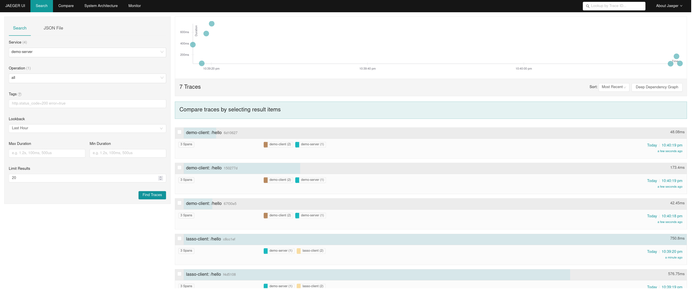

Simple app forked from OTL and update to use an auto instrumented python client

This auto instruments a Python Application for distributed tracing. Configures it for metric and logs exports with minimal code. An OTEL Collector sits in between the Apps , (There is a Go Server) and then exports this OTEL format data to the awaiting clients. 


source:OTEL Examples Repo

### Run
```
docker-compose up -d
```
Hit the Client End point and then access the various tracing Services below to see Logs, Metrics & Dist Traces

### Run Python app locally

Create a virt env
```
python -m pip install -r requirements.txt
cd client
flask run #(or use cmd from Dockerfile)
```


### Services
 - Jaeger (Tracing, Exception Logging) http://localhost:16686/
 - Python Flask Client, auto-instrumented http://localhost:5000/hello
 - OTEL Collector Contrib (with logging pre release)
 - Prometheus, metrics http://localhost:9090
 - Grafana / Loki for App Logging http://localhost:3000 (Add loki on loki:3100  as Loki Data Source, and Prom on 9090 if you want)

## Screenshots





